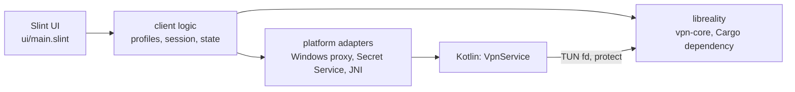

# Reality Client

[Русский](README.md) | **English**

[](https://github.com/ERGFT/reality-client/actions/workflows/rust-linux.yml)
[](https://github.com/ERGFT/reality-client/actions/workflows/rust-windows.yml)
[](https://github.com/ERGFT/reality-client/actions/workflows/rust-android.yml)
[](LICENSE.txt)


A graphical VPN client written in **Rust + Slint** for the
[**vpn-core**](https://github.com/ERGFT/vpn-core) network core (VLESS, REALITY,
XTLS Vision). One UI codebase for every platform: paste a `vless://…` link, press
the power button, and the client starts the core, enables a proxy or a TUN
device, and shows speed, traffic, connections and logs.

<p align="center">
  
</p>

<p align="center">
  
</p>

## Naming

| Name | What it is |
|---|---|
| **reality-client** | this repository: the graphical application |
| **vpn-core** | [the core repository](https://github.com/ERGFT/vpn-core): protocols, routing, DNS, TUN |
| **libreality** | the core as a library with a C ABI (`ffi/` in vpn-core); the client links it in as a Cargo dependency (no separate `.dll`/`.so` in the package) |
| **Reality Core** | the same core, as it is called in the UI |

## Platforms and status

| Platform | Build | Verified | Not yet verified |
|---|---|---|---|
| **Windows x64** | `rust-client/build-windows.ps1` | build and tests on the developer machine ([log](docs/BUILD-LOG.md), Russian) | system proxy and TUN on a clean machine, real traffic |
| **Android arm64** | `rust-client/build-android.sh` | debug APK builds and starts in an emulator | `VpnService`/TUN on a device, real traffic, dynamic colours on a device |
| **Linux x86_64** | `rust-client/build-linux.sh` | build, 51 tests and window startup on Ubuntu 24.04 | real traffic, TUN, Secret Service on a real desktop |
| macOS, iOS, tvOS | — | — | postponed, see [PLAN.en.md](PLAN.en.md) |

> [!WARNING]
> **Pre-release stage.** No platform has been verified end-to-end ("client →
> real REALITY server → website") yet. There has been no third-party security
> audit. This is not a replacement for mature clients. See the detailed matrix in
> [docs/STATUS.en.md](docs/STATUS.en.md).

## Features

- **Profiles.** Several VLESS profiles; the secret link lives in the OS secure
  store (DPAPI, Secret Service, Android Keystore) and never reaches the log.
- **Modes.** Local proxy (SOCKS5/HTTP) and a full core config: TUN, DNS fake-IP,
  routing rules by domain and IP.
- **Validation before start.** The core checks the config; errors are shown as
  plain text with secrets redacted.
- **Windows system proxy** with a backup and crash recovery.
- **Android.** `VpnService`, per-app filter, TUN descriptor hand-off to the core,
  Material 3 Expressive styling and system dynamic colours (Android 12+).
- **Statistics.** Speed, traffic, active connections, server groups.
- **Look.** Dark and light themes, one adaptive UI for phone and desktop
  ([docs/DESIGN.en.md](docs/DESIGN.en.md)).

## Quick start

### Linux

```sh
sudo apt install build-essential cmake nasm pkg-config git python3 \
    libdbus-1-dev libfontconfig1-dev libfreetype6-dev \
    libxkbcommon-dev libxkbcommon-x11-dev libwayland-dev libx11-dev libgl1-mesa-dev
cd rust-client
./build-linux.sh          # build and package into dist/linux-x86_64
./install-linux.sh        # install to ~/.local/opt/reality-client + launcher and icon
```

UI and tests only, without building the core: `cd rust-client && cargo test --locked`.

### Windows and Android

Step-by-step instructions, TUN, privileges and limits: [docs/PLATFORMS.en.md](docs/PLATFORMS.en.md).

> [!NOTE]
> [Releases](https://github.com/ERGFT/reality-client/releases) currently hold
> pre-releases only (`v0.1.0-preview.*`, Windows x64 and a debug APK).

## How it works



- **`rust-client/`**: the app: shared Rust code, Slint UI, platform adapters and a
  thin Kotlin layer for `VpnService`.
- **vpn-core** is pinned by a commit hash (`third_party/vpn-core.rev`) and fetched by the
  build scripts. A move to a Cargo dependency is planned: [PLAN.en.md](PLAN.en.md).
- **`src/`**: the previous C# version (archive): [docs/LEGACY-CSHARP.md](docs/LEGACY-CSHARP.md).

More: [docs/ARCHITECTURE.en.md](docs/ARCHITECTURE.en.md).

## Documentation

| File | What |
|---|---|
| [docs/README.en.md](docs/README.en.md) | documentation index |
| [docs/ARCHITECTURE.en.md](docs/ARCHITECTURE.en.md) | client internals, threads, secret storage |
| [docs/DESIGN.en.md](docs/DESIGN.en.md) | design system, Material 3 Expressive, dynamic colours |
| [docs/PLATFORMS.en.md](docs/PLATFORMS.en.md) | build and run on Windows, Linux, Android |
| [docs/STATUS.en.md](docs/STATUS.en.md) | what is verified and what is not |
| [PLAN.en.md](PLAN.en.md) | roadmap |
| [CONTRIBUTING.en.md](CONTRIBUTING.en.md) | how to build, test and contribute |
| [SECURITY.md](SECURITY.md) | how to report a vulnerability |
| [SUPPORT.md](SUPPORT.md#support) | where to get help |
| [CODE_OF_CONDUCT.md](CODE_OF_CONDUCT.md#contributor-covenant-code-of-conduct) | code of conduct |
| [CHANGELOG.md](CHANGELOG.md) | changelog |

## License

GPL-3.0-or-later ([LICENSE.txt](LICENSE.txt)). The client embeds a GPL core and is
therefore distributed under the same terms. Third-party components:
[THIRD_PARTY.md](THIRD_PARTY.md).
