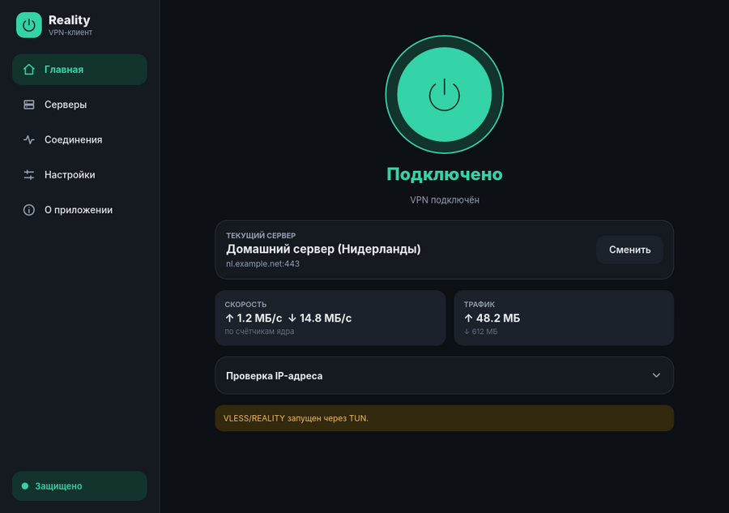
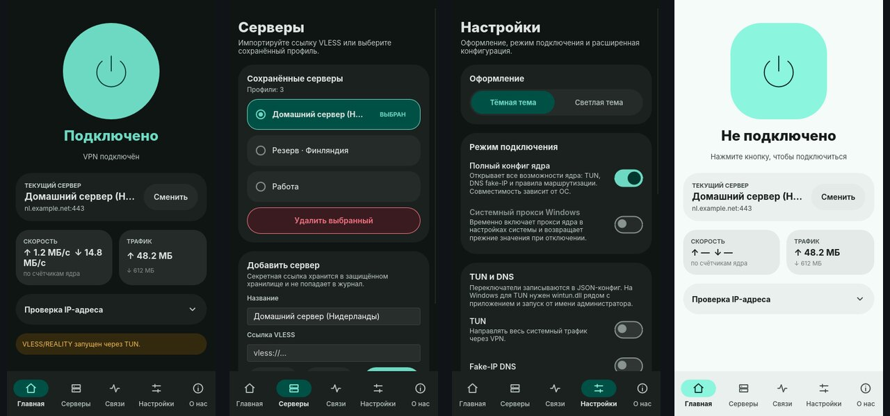
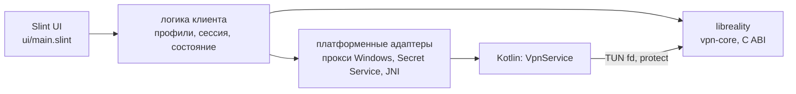

# Reality Client

**Русский** | [English](README.en.md)

[](https://github.com/ERGFT/reality-client/actions/workflows/rust-linux.yml)
[](https://github.com/ERGFT/reality-client/actions/workflows/rust-windows.yml)
[](https://github.com/ERGFT/reality-client/actions/workflows/rust-android.yml)
[](LICENSE.txt)


Графический VPN-клиент на **Rust + Slint** для сетевого ядра
[**vpn-core**](https://github.com/ERGFT/vpn-core) (VLESS, REALITY, XTLS Vision).
Один код интерфейса на все платформы: вставляете ссылку `vless://…`, нажимаете
кнопку питания — клиент запускает ядро, включает прокси или TUN и показывает
скорость, трафик, соединения и журнал.

<p align="center">
  
</p>

<p align="center">
  
</p>

## Что как называется

| Название | Что это |
|---|---|
| **reality-client** | этот репозиторий: графическое приложение |
| **vpn-core** | [репозиторий ядра](https://github.com/ERGFT/vpn-core): протоколы, маршрутизация, DNS, TUN |
| **libreality** | ядро как библиотека с C ABI (`ffi/` в vpn-core); клиент загружает её на каждой платформе |
| **Reality Core** | то же ядро, как оно называется в интерфейсе |

## Платформы и статус

| Платформа | Сборка | Что проверено | Чего ещё нет |
|---|---|---|---|
| **Windows x64** | `rust-client/build-windows.ps1` | сборка и тесты на машине разработчика ([журнал](docs/BUILD-LOG.md)) | системный прокси и TUN на чистой машине, трафик через сервер |
| **Android arm64** | `rust-client/build-android.sh` | отладочный APK собирается, запускается в эмуляторе | `VpnService`/TUN на устройстве, трафик через сервер, динамические цвета на устройстве |
| **Linux x86_64** | `rust-client/build-linux.sh` | сборка, 51 тест и запуск окна на Ubuntu 24.04 | трафик через сервер, TUN, Secret Service на реальном рабочем столе |
| macOS, iOS, tvOS | — | — | отложено, см. [PLAN.md](PLAN.md) |

> [!WARNING]
> Проект на стадии **предварительных сборок**. Ни одна платформа пока не
> проверена сквозным сценарием «клиент → настоящий сервер REALITY → сайт».
> Стороннего аудита безопасности нет. Это не замена зрелым клиентам.
> Подробная матрица — в [docs/STATUS.md](docs/STATUS.md).

## Возможности

- **Профили.** Несколько VLESS-профилей; секретная ссылка хранится в защищённом
  хранилище ОС (DPAPI, Secret Service, Android Keystore) и не попадает в журнал.
- **Режимы.** Локальный прокси (SOCKS5/HTTP) и полный конфиг ядра: TUN, DNS
  fake-IP, правила маршрутизации по доменам и IP.
- **Проверка до запуска.** Конфигурация проверяется ядром, ошибки показываются
  понятным текстом с очищенными секретами.
- **Системный прокси Windows** с резервной копией и восстановлением после сбоя.
- **Android.** `VpnService`, фильтр приложений, передача TUN-дескриптора ядру,
  стиль Material 3 Expressive и динамические цвета системы (Android 12+).
- **Статистика.** Скорость, трафик, активные соединения, группы серверов.
- **Оформление.** Тёмная и светлая темы, адаптивный интерфейс для телефона и
  компьютера ([docs/DESIGN.md](docs/DESIGN.md)).

## Быстрый старт

### Linux

```sh
sudo apt install build-essential cmake nasm pkg-config git python3 \
    libdbus-1-dev libfontconfig1-dev libfreetype6-dev \
    libxkbcommon-dev libxkbcommon-x11-dev libwayland-dev libx11-dev libgl1-mesa-dev
cd rust-client
./build-linux.sh          # сборка и пакет в dist/linux-x86_64
./install-linux.sh        # установка в ~/.local/opt/reality-client + ярлык и иконка
```

Только интерфейс и тесты, без сборки ядра: `cd rust-client && cargo test --locked`.

### Windows и Android

Пошаговые инструкции, TUN, права и ограничения — в [docs/PLATFORMS.md](docs/PLATFORMS.md).

> [!NOTE]
> Готовых сборок в [Releases](https://github.com/ERGFT/reality-client/releases)
> пока только предварительные (`v0.1.0-preview.*`, Windows x64 и отладочный APK).

## Как это устроено



- **`rust-client/`** — приложение: общий Rust-код, интерфейс Slint, платформенные
  адаптеры и тонкий слой Kotlin для `VpnService`.
- **vpn-core** закреплён хешем коммита (`third_party/vpn-core.rev`) и скачивается
  скриптами сборки. Планируется переход на зависимость Cargo — [PLAN.md](PLAN.md).
- **`src/`** — прежняя версия на C# (архив): [docs/LEGACY-CSHARP.md](docs/LEGACY-CSHARP.md).

Подробнее: [docs/ARCHITECTURE.md](docs/ARCHITECTURE.md).

## Документация

| Файл | О чём |
|---|---|
| [docs/README.md](docs/README.md) | оглавление документации |
| [docs/ARCHITECTURE.md](docs/ARCHITECTURE.md) | устройство клиента, потоки, хранение секретов |
| [docs/DESIGN.md](docs/DESIGN.md) | дизайн-система, Material 3 Expressive, динамические цвета |
| [docs/PLATFORMS.md](docs/PLATFORMS.md) | сборка и запуск на Windows, Linux, Android |
| [docs/STATUS.md](docs/STATUS.md) | что проверено и что нет |
| [PLAN.md](PLAN.md) | дорожная карта |
| [CONTRIBUTING.md](CONTRIBUTING.md) | как собирать, проверять и вносить изменения |
| [SECURITY.md](SECURITY.md) | как сообщить об уязвимости |
| [SUPPORT.md](SUPPORT.md) | где получить помощь |
| [CODE_OF_CONDUCT.md](CODE_OF_CONDUCT.md) | кодекс поведения |
| [CHANGELOG.md](CHANGELOG.md) | журнал изменений |

## Лицензия

GPL-3.0-or-later ([LICENSE.txt](LICENSE.txt)). Клиент встраивает ядро под GPL,
поэтому распространяется на тех же условиях. Сторонние компоненты —
[THIRD_PARTY.md](THIRD_PARTY.md).
