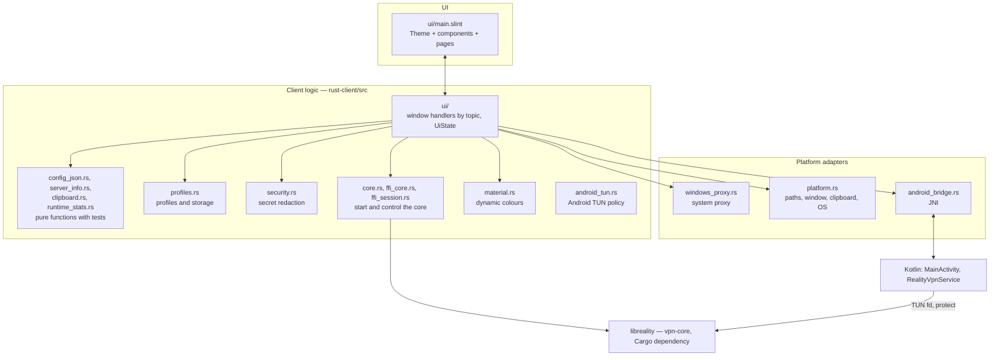
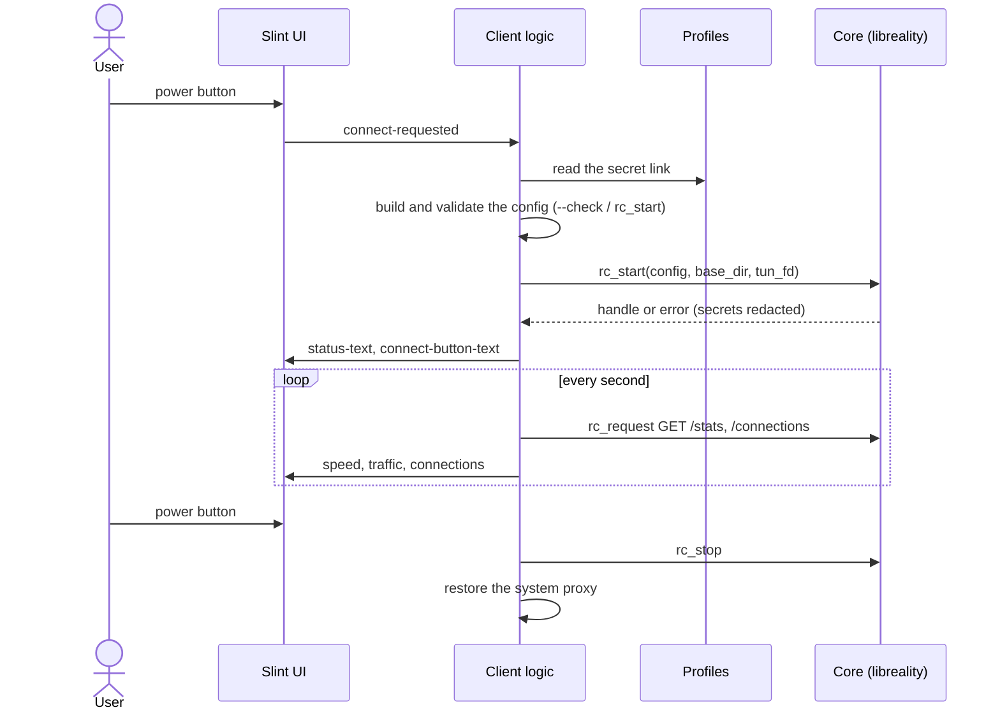

[Русский](ARCHITECTURE.md) | [English](ARCHITECTURE.en.md)

# Client internals

For anyone who reads, changes or extends the client. Usage is in the
[README](../README.en.md); work stages are in [PLAN.en.md](../PLAN.en.md).

Contents:

1. [Layers](#1-layers)
2. [Connection lifecycle](#2-connection-lifecycle)
3. [UI](#3-ui)
4. [The core](#4-the-core)
5. [Threads](#5-threads)
6. [Android](#6-android)
7. [Secret storage](#7-secret-storage)
8. [Repository map](#8-repository-map)
9. [Known technical debt](#9-known-technical-debt)

## 1. Layers

Everything above the "adapters" line is shared between platforms. Platform code
is isolated behind `cfg(...)` and verified separately.

## 2. Connection lifecycle

The UI derives the power button state from `connect-button-text`: "Подключить"
(Connect) means off, "Отключить" (Disconnect) means on, anything else means an
operation is in progress.

## 3. UI

- A single file, `ui/main.slint`. Colours, sizes and shapes live in the global
  `Theme`; components use only its tokens ([DESIGN.en.md](DESIGN.en.md)).
- One adaptive layout: a sidebar on desktop, a bottom navigation bar on phones
  (`mobile-layout`, set by the Android entry point).
- The link to Rust is the set of `property`/`callback` items on the root
  `MainWindow`. Rust sets the status strings; the markup derives the look from them.
- To work on the UI without the core: `slint-viewer ui/main.slint --component
  MainWindow --load-data demo.json` ([CONTRIBUTING.en.md](../CONTRIBUTING.en.md)).

## 4. The core

vpn-core is a Cargo dependency (`reality-ffi`, path `third_party/vpn-core/ffi`) linked
into the application itself on every platform: there is no separate `.dll`/`.so` and no
`libloading`. The client calls the C ABI functions as ordinary Rust functions through the
`ffi_core.rs` wrapper: `rc_start`, `rc_request`, `rc_reload`, `rc_stop`, event and log
callbacks, `rc_set_protect` (Android), `rc_set_lock_dir` (Windows). The
config is sing-box/Xray JSON; the VLESS link is turned into it through a private
temporary file (`link_file`) so the secret never lands in process arguments.

The core version is pinned by a commit hash in `third_party/vpn-core.rev`; the
build tasks (`cargo xtask fetch-core`) fetch exactly that
commit from the vpn-core repository into `third_party/vpn-core/` (outside git); fetch it
before any `cargo` command. A commit hash fixes the content by itself, so no separate
checksum or local patches are needed. The core's dependency patches (`rustls` for
REALITY, `smoltcp`) are repeated in `[patch.crates-io]` of `rust-client/Cargo.toml` and
change only together with vpn-core. The core's command-line program `reality-client`
is still built separately: the GUI runs it for config checks, system-proxy recovery
and TUN cleanup.

> [!NOTE]
> Next step for the core: drop the C ABI shell on desktop and call `reality-core`
> directly (no `unsafe`). For now the client calls the same `rc_*` functions Kotlin uses on Android.

## 5. Threads

- Blocking calls (secret store reads, file dialogs, `rc_request`, IP checks) run
  off the UI thread and return results through `slint::invoke_from_event_loop`.
- Core callbacks arrive on its background threads; data goes into a log queue the
  UI drains on a timer.
- One core handle per session. A second start during a start, or a stop during a
  stop, is rejected by state flags.
- On window close (Windows, Linux) the client waits for active operations, stops
  the core and does not exit until the system proxy has been restored.

## 6. Android

The `VpnService` class has to be Kotlin/Java: it requests permission, creates the
TUN device, holds the foreground notification and hands the descriptor to the
core. UI, profiles and logic are Rust (`slint` + `android-activity`).

- The config reaches the service through a temporary file in the app-private
  directory, not an `Intent` (Binder size limit). The file is erased after it is
  read, cancelled or fails.
- The TUN policy lives entirely in Rust (`android_tun.rs`, tested on the host): before
  `establish()` the service calls `nativePlanTun`, and Rust validates the config (exactly
  one `tun` inbound, supported options, app filter, MTU, boolean flags without silent
  coercion), computes the addresses, the in-subnet DNS address and the routes, and strips
  `include_package` from the config handed to the core. Kotlin only applies the plan to
  `VpnService.Builder`. Anything unsupported is rejected before the interface exists.
- Kotlin keeps what needs Android APIs: the check for another active VPN, the
  permission, the notification, `establish()` and handing over the descriptor.
- Colours: `MainActivity.readSystemPalette()` reads the Material You palette;
  `material.rs` maps it to tokens ([DESIGN.en.md](DESIGN.en.md#dynamic-colours-android)).

## 7. Secret storage

| OS | Store |
|---|---|
| Windows | DPAPI (CurrentUser); format compatible with the previous C# version |
| Linux | Secret Service (libsecret / D-Bus) |
| Android | AES-GCM + Android Keystore |

Secrets are not written to logs, process arguments or error messages
(`security.rs` redacts links, UUIDs and query parameters). The profile store is
capped at 2 MiB and links at 16 KiB.

## 8. Repository map

| Path | What |
|---|---|
| `rust-client/src/ui/` | window handlers by topic: `appearance`, `diagnostics`, `config_editor`, `profiles`, `connection`, `groups`, `runtime` (timers); shared state `UiState` in `mod.rs` |
| `rust-client/src/*.rs` | pure logic with tests (`config_json`, `server_info`, `clipboard`, `runtime_stats`, `profiles`, `security`), starting the core (`core`, `ffi_*`) and platform adapters |
| `rust-client/ui/main.slint` | the UI |
| `rust-client/android/` | Kotlin: `MainActivity`, `RealityVpnService` (thin shell), JVM tests for the staged config file |
| `rust-client/assets/` | app icon |
| `rust-client/build-*.{sh,ps1}` | per-platform package builds |
| `xtask/` | `cargo xtask`: `fetch-core` (the core by commit hash), `core-cli`, `package-windows`, `test-windows` |
| `third_party/` | `vpn-core.rev` (core commit), `wintun.dll` |
| `src/`, `build.ps1`, `dist/` | previous C# version (archive) |
| `.github/workflows/` | CI: Linux, Windows, Android |

## 9. Known technical debt

- The `install` functions in `ui/` are still large (handlers are closures sharing `Arc`s);
  they can be split further, but behaviour is already grouped by topic (stage 5 done).
- The core is called through C ABI functions (`ffi_core.rs`, `unsafe`); calling
  `reality-core` directly without the C ABI is a separate step.
- The client's `Cargo.lock` holds the whole core dependency graph, and `[patch.crates-io]`
  duplicates vpn-core's root `Cargo.toml`: when the core commit changes, compare both.
- Binary files are tracked in git (`dist/`, `third_party/reality-client.exe` for C#, `wintun.dll`).
- The Kotlin part of Android is now minimal (stage 7 done) but not checked on a device: the TUN policy is in Rust and covered by host tests only.
