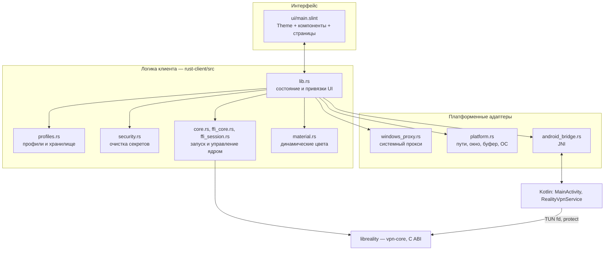
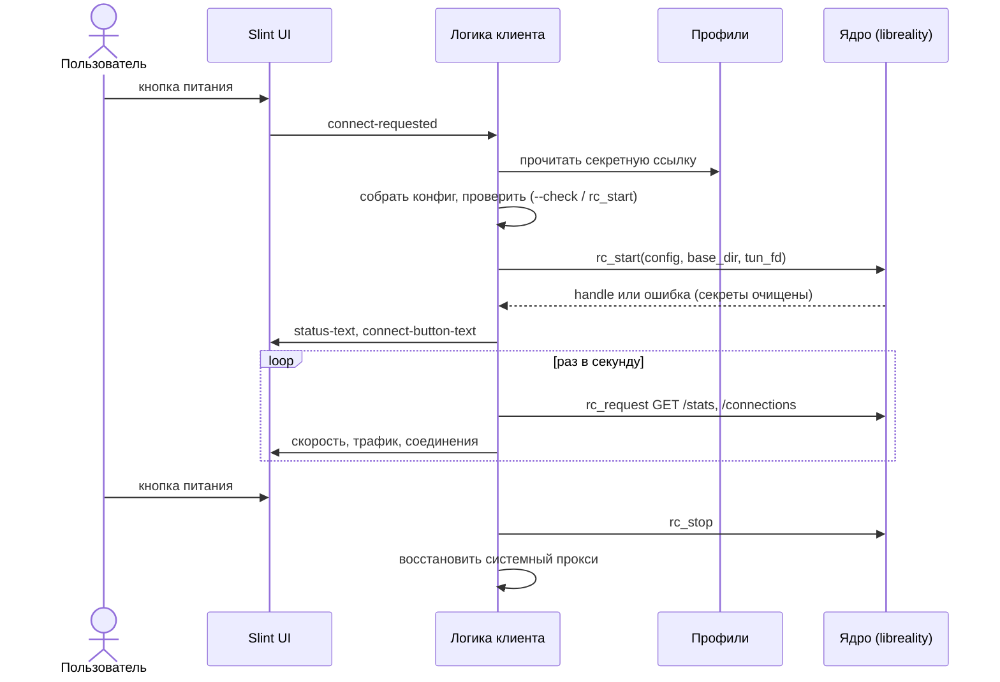

[Русский](ARCHITECTURE.md) | [English](ARCHITECTURE.en.md)

# Устройство клиента

Для тех, кто будет читать, менять или расширять клиент. Как пользоваться —
в [README](../README.md); этапы работ — в [PLAN.md](../PLAN.md).

Содержание:

1. [Слои](#1-слои)
2. [Жизненный цикл подключения](#2-жизненный-цикл-подключения)
3. [Интерфейс](#3-интерфейс)
4. [Ядро](#4-ядро)
5. [Потоки](#5-потоки)
6. [Android](#6-android)
7. [Хранение секретов](#7-хранение-секретов)
8. [Карта репозитория](#8-карта-репозитория)
9. [Известный технический долг](#9-известный-технический-долг)

## 1. Слои

Общего у платформ — всё, что выше линии «адаптеры». Платформенный код
изолирован за `cfg(...)` и проверяется отдельно.

## 2. Жизненный цикл подключения

Состояние кнопки питания выводится в интерфейсе из `connect-button-text`:
«Подключить» — выключено, «Отключить» — включено, остальное — идёт операция.

## 3. Интерфейс

- Один файл `ui/main.slint`. Цвета, размеры и формы — в глобальном `Theme`;
  компоненты используют только его токены ([DESIGN.md](DESIGN.md)).
- Один адаптивный макет: боковая панель на компьютере, нижняя навигация на
  телефоне (`mobile-layout`, его выставляет Android-вход).
- Связь с Rust — набор `property`/`callback` корневого `MainWindow`. Строки
  состояния задаёт Rust, вёрстка выводит из них вид.
- Для разработки без ядра: `slint-viewer ui/main.slint --component MainWindow
  --load-data demo.json` ([CONTRIBUTING.md](../CONTRIBUTING.md)).

## 4. Ядро

vpn-core подключается как библиотека через C ABI: `rc_start`, `rc_request`,
`rc_reload`, `rc_stop`, колбэки событий и журнала, `rc_set_protect` (Android),
`rc_set_lock_dir` (Windows). Клиент загружает её динамически (`libloading`).
Конфигурация — JSON sing-box/Xray; из VLESS-ссылки строится в приватном
временном файле (`link_file`), чтобы секрет не попадал в аргументы процесса.

Версия ядра закреплена коммитом (`third_party/vpn-core-source.commit`) и
проверяется по SHA-256. Применяется локальный патч владения TUN-дескриптором
(`rust-client/patches/`).

> [!NOTE]
> Целевая схема (этап 4 в [PLAN.md](../PLAN.md)): `reality-core` как обычная
> зависимость Cargo без C ABI и `unsafe`-обёрток на десктопе. C ABI остаётся
> только там, где ядро грузится в процесс с Kotlin-слоем (Android).

## 5. Потоки

- Блокирующие вызовы (чтение хранилища, файловые диалоги, `rc_request`,
  проверка IP) выполняются вне потока интерфейса и возвращают результат через
  `slint::invoke_from_event_loop`.
- Колбэки ядра приходят из его фоновых потоков; данные кладутся в очередь
  журнала, UI читает её по таймеру.
- Один handle ядра на сессию. Повторный запуск во время запуска и остановка во
  время остановки запрещены флагами состояния.
- При закрытии окна (Windows, Linux) клиент дожидается активных операций,
  останавливает ядро и не закрывается, пока не восстановлен системный прокси.

## 6. Android

Класс `VpnService` обязан быть на Kotlin/Java: он запрашивает разрешение,
создаёт TUN, держит foreground-уведомление и отдаёт дескриптор ядру.
Интерфейс, профили и логика — в Rust (`slint` + `android-activity`).

- Конфигурация передаётся через временный файл в приватном каталоге
  приложения, а не через `Intent` (ограничение Binder). Файл стирается после
  чтения, отмены или ошибки.
- Перед `establish()` служба проверяет конфиг: ровно один `tun`-вход,
  поддерживаемые маршруты и фильтр приложений. Неподдерживаемое — отказ до
  создания интерфейса.
- Цвета: `MainActivity.readSystemPalette()` читает палитру Material You;
  `material.rs` переводит её в токены ([DESIGN.md](DESIGN.md#динамические-цвета-android)).

## 7. Хранение секретов

| ОС | Хранилище |
|---|---|
| Windows | DPAPI (CurrentUser); формат совместим с прежней версией на C# |
| Linux | Secret Service (libsecret / D-Bus) |
| Android | AES-GCM + Android Keystore |

Секреты не пишутся в журнал, в аргументы процесса и в сообщения об ошибках
(`security.rs` очищает ссылки, UUID и параметры запроса). Размер хранилища
профилей ограничен 2 МиБ, ссылки — 16 КиБ.

## 8. Карта репозитория

| Путь | Что |
|---|---|
| `rust-client/src/` | логика клиента и платформенные адаптеры |
| `rust-client/ui/main.slint` | интерфейс |
| `rust-client/android/` | Kotlin: `MainActivity`, `RealityVpnService`, политика TUN, JVM-тесты |
| `rust-client/assets/` | иконка приложения |
| `rust-client/build-*.{sh,ps1}` | сборка пакетов под платформы |
| `rust-client/patches/` | локальные патчи закреплённого ядра |
| `third_party/` | закреплённое ядро, `wintun.dll` |
| `src/`, `build.ps1`, `dist/` | прежняя версия на C# (архив) |
| `.github/workflows/` | CI: Linux, Windows, Android |

## 9. Известный технический долг

- `rust-client/src/lib.rs` — монолит около 3600 строк: состояние, обработчики и
  привязки UI надо разнести по модулям (этап 5).
- Ядро собирается из zip-архива с Python-патчем (этап 4).
- В git лежат бинарные файлы (`dist/`, `third_party/*.exe`, `*.zip`, `wintun.dll`).
- Политика Android-TUN живёт в Kotlin; её стоит перенести в Rust (этап 7).
