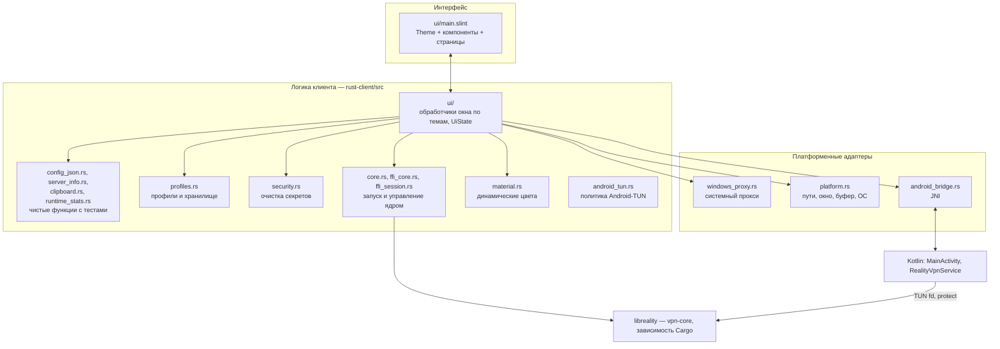
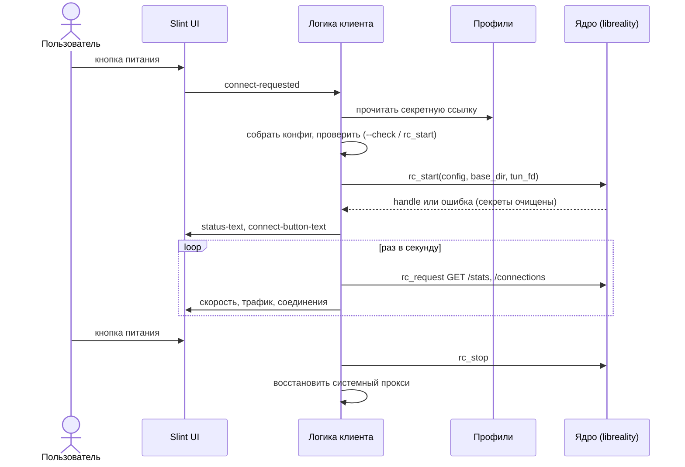

[Русский](ARCHITECTURE.md) | [English](ARCHITECTURE.en.md)

# Устройство клиента

Для тех, кто будет читать, менять или расширять клиент. Как пользоваться —
в [README](../README.md); этапы работ — в [PLAN.md](../PLAN.md).

Содержание:

1. [Слои](#1-слои)
2. [Жизненный цикл подключения](#2-жизненный-цикл-подключения)
3. [Интерфейс](#3-интерфейс)
4. [Ядро](#4-ядро)
5. [Потоки](#5-потоки)
6. [Android](#6-android)
7. [Хранение секретов](#7-хранение-секретов)
8. [Карта репозитория](#8-карта-репозитория)
9. [Известный технический долг](#9-известный-технический-долг)

## 1. Слои

Общего у платформ — всё, что выше линии «адаптеры». Платформенный код
изолирован за `cfg(...)` и проверяется отдельно.

## 2. Жизненный цикл подключения

Состояние кнопки питания выводится в интерфейсе из `connect-button-text`:
«Подключить» — выключено, «Отключить» — включено, остальное — идёт операция.

## 3. Интерфейс

- Один файл `ui/main.slint`. Цвета, размеры и формы — в глобальном `Theme`;
  компоненты используют только его токены ([DESIGN.md](DESIGN.md)).
- Один адаптивный макет: боковая панель на компьютере, нижняя навигация на
  телефоне (`mobile-layout`, его выставляет Android-вход).
- Связь с Rust — набор `property`/`callback` корневого `MainWindow`. Строки
  состояния задаёт Rust, вёрстка выводит из них вид.
- Для разработки без ядра: `slint-viewer ui/main.slint --component MainWindow
  --load-data demo.json` ([CONTRIBUTING.md](../CONTRIBUTING.md)).

## 4. Ядро

vpn-core — зависимость Cargo (`reality-ffi`, путь `third_party/vpn-core/ffi`) и
линкуется в само приложение на всех платформах: отдельной `.dll`/`.so` нет, `libloading`
не нужен. Клиент вызывает функции C ABI как обычные Rust-функции через обёртку
`ffi_core.rs`: `rc_start`, `rc_request`, `rc_reload`, `rc_stop`, колбэки событий и
журнала, `rc_set_protect` (Android), `rc_set_lock_dir` (Windows).
Конфигурация — JSON sing-box/Xray; из VLESS-ссылки строится в приватном
временном файле (`link_file`), чтобы секрет не попадал в аргументы процесса.

Версия ядра закреплена хешем коммита в `third_party/vpn-core.rev`; скрипты
сборки (`cargo xtask fetch-core`) скачивают из
репозитория vpn-core ровно этот коммит в `third_party/vpn-core/` (каталог вне git);
перед любым `cargo` его нужно скачать. Хеш коммита сам гарантирует содержимое,
отдельная контрольная сумма и локальные патчи не нужны. Патчи зависимостей ядра
(`rustls` для REALITY, `smoltcp`) повторены в `[patch.crates-io]` файла
`rust-client/Cargo.toml` и меняются только вместе с vpn-core. Консольная программа ядра
`reality-client` по-прежнему собирается отдельно: GUI запускает её для проверки
конфигурации, восстановления системного прокси и очистки TUN.

> [!NOTE]
> Следующий шаг по ядру: убрать оболочку C ABI на десктопе и вызывать `reality-core`
> напрямую (без `unsafe`). Сейчас клиент вызывает те же `rc_*`, что и Kotlin на Android.

## 5. Потоки

- Блокирующие вызовы (чтение хранилища, файловые диалоги, `rc_request`,
  проверка IP) выполняются вне потока интерфейса и возвращают результат через
  `slint::invoke_from_event_loop`.
- Колбэки ядра приходят из его фоновых потоков; данные кладутся в очередь
  журнала, UI читает её по таймеру.
- Один handle ядра на сессию. Повторный запуск во время запуска и остановка во
  время остановки запрещены флагами состояния.
- При закрытии окна (Windows, Linux) клиент дожидается активных операций,
  останавливает ядро и не закрывается, пока не восстановлен системный прокси.

## 6. Android

Класс `VpnService` обязан быть на Kotlin/Java: он запрашивает разрешение,
создаёт TUN, держит foreground-уведомление и отдаёт дескриптор ядру.
Интерфейс, профили и логика — в Rust (`slint` + `android-activity`).

- Конфигурация передаётся через временный файл в приватном каталоге
  приложения, а не через `Intent` (ограничение Binder). Файл стирается после
  чтения, отмены или ошибки.
- Политика TUN целиком в Rust (`android_tun.rs`, тесты идут на хосте): перед
  `establish()` служба вызывает `nativePlanTun`, и Rust проверяет конфиг (ровно
  один `tun`-вход, поддерживаемые параметры, фильтр приложений, MTU, логические
  флаги без молчаливых приведений), считает адреса, адрес DNS в подсети и маршруты и
  убирает `include_package` из конфигурации для ядра. Kotlin только применяет план
  к `VpnService.Builder`. Неподдерживаемое — отказ до создания интерфейса.
- В Kotlin остаётся то, что требует Android API: проверка чужого активного VPN,
  разрешение, уведомление, `establish()`, передача дескриптора.
- Цвета: `MainActivity.readSystemPalette()` читает палитру Material You;
  `material.rs` переводит её в токены ([DESIGN.md](DESIGN.md#динамические-цвета-android)).

## 7. Хранение секретов

| ОС | Хранилище |
|---|---|
| Windows | DPAPI (CurrentUser); формат совместим с прежней версией на C# |
| Linux | Secret Service (libsecret / D-Bus) |
| Android | AES-GCM + Android Keystore |

Секреты не пишутся в журнал, в аргументы процесса и в сообщения об ошибках
(`security.rs` очищает ссылки, UUID и параметры запроса). Размер хранилища
профилей ограничен 2 МиБ, ссылки — 16 КиБ.

## 8. Карта репозитория

| Путь | Что |
|---|---|
| `rust-client/src/ui/` | обработчики окна по темам: `appearance`, `diagnostics`, `config_editor`, `profiles`, `connection`, `groups`, `runtime` (таймеры), общее состояние `UiState` в `mod.rs` |
| `rust-client/src/*.rs` | чистая логика с тестами (`config_json`, `server_info`, `clipboard`, `runtime_stats`, `profiles`, `security`), запуск ядра (`core`, `ffi_*`) и платформенные адаптеры |
| `rust-client/ui/main.slint` | интерфейс |
| `rust-client/android/` | Kotlin: `MainActivity`, `RealityVpnService` (тонкая оболочка), JVM-тесты временного файла конфигурации |
| `rust-client/assets/` | иконка приложения |
| `rust-client/build-*.{sh,ps1}` | сборка пакетов под платформы |
| `xtask/` | `cargo xtask`: `fetch-core` (ядро по хешу коммита), `core-cli`, `package-windows`, `test-windows` |
| `third_party/` | `vpn-core.rev` (коммит ядра), `wintun.dll` |
| `src/`, `build.ps1`, `dist/` | прежняя версия на C# (архив) |
| `.github/workflows/` | CI: Linux, Windows, Android |

## 9. Известный технический долг

- В `ui/` по-прежнему большие функции `install` (обработчики — замыкания с общими `Arc`);
  их можно дробить дальше, но поведение уже разнесено по темам (этап 5 выполнен).
- Ядро вызывается через функции C ABI (`ffi_core.rs`, `unsafe`); прямой вызов
  `reality-core` без C ABI — отдельный шаг.
- `Cargo.lock` клиента содержит весь граф зависимостей ядра, а `[patch.crates-io]`
  дублирует корневой `Cargo.toml` vpn-core: при смене коммита ядра сверять оба.
- В git лежат бинарные файлы (`dist/`, `third_party/reality-client.exe` для C#, `wintun.dll`).
- Kotlin-часть Android осталась минимальной (этап 7 выполнен), но не проверена на устройстве: политика TUN теперь в Rust и покрыта тестами только на хосте.
