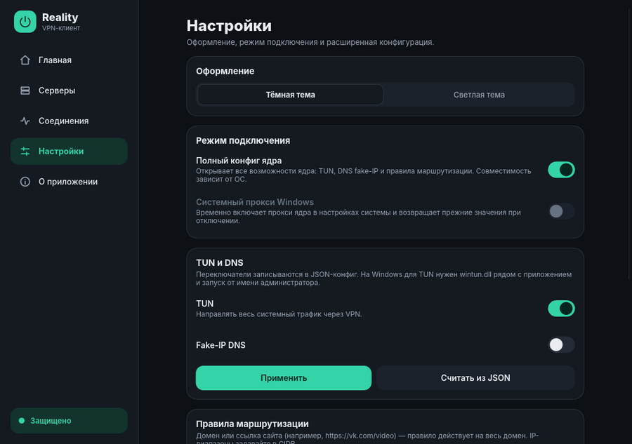

[Русский](DESIGN.md) | [English](DESIGN.en.md)

# Дизайн-система

Интерфейс — один файл `rust-client/ui/main.slint`. Все цвета, скругления и
размеры берутся из глобального `Theme`, а не пишутся по месту.

Содержание:

1. [Принципы](#1-принципы)
2. [Токены](#2-токены)
3. [Компоненты](#3-компоненты)
4. [Раскладка](#4-раскладка)
5. [Material 3 Expressive на Android](#5-material-3-expressive-на-android)
6. [Динамические цвета Android](#динамические-цвета-android)
7. [Как проверить вид без ядра](#7-как-проверить-вид-без-ядра)

<p align="center">
  
</p>

## 1. Принципы

- **Один интерфейс.** Различия платформ — в токенах и раскладке, а не в копиях экранов.
- **Состояние из строк.** Rust задаёт `status-text` и `connect-button-text`;
  вёрстка выводит из них вид кнопки питания и индикаторов.
- **Без шрифтовых значков.** Иконки нарисованы векторно (`Path`), поэтому не
  превращаются в «квадратики» на устройствах без нужного шрифта.
- **Доступность.** Кнопки, переключатели и вкладки имеют `accessible-*` роли и подписи.

## 2. Токены

`Theme` содержит цвета для четырёх режимов: тёмная и светлая тема, обычная и M3.

| Токен | Назначение |
|---|---|
| `bg` | фон окна |
| `surface`, `surface-2`, `surface-3` | карточки, плитки, наведение — три ступени |
| `outline` | границы и разделители |
| `text`, `dim`, `faint` | основной, вторичный, приглушённый текст |
| `accent`, `accent-hover`, `accent-soft`, `on-accent`, `on-accent-container` | основной цвет, его фон-контейнер и цвет текста на них |
| `warn`, `warn-soft`, `danger`, `danger-soft` | предупреждения и опасные действия |
| `r-card`, `r-tile`, `r-row`, `r-field` | радиусы скругления |
| `m3`, `dynamic`, `dark` | режимы: Material 3, системные цвета, тёмная тема |

## 3. Компоненты

| Компонент | Что |
|---|---|
| `Card`, `Stat`, `Notice`, `Chip` | контейнеры и плашки |
| `Btn` | кнопка: `kind` 0 — основная, 1 — тональная, 2 — контурная, 3 — опасная |
| `Toggle`, `ToggleRow`, `Segmented` | переключатели и сегментированный выбор |
| `PowerButton` | главная кнопка: 0 — выкл., 1 — идёт операция, 2 — вкл. |
| `ProfileRow`, `IpRow` | строка профиля, строка проверки IP |
| `RailItem`, `TabItem` | навигация: боковая панель и нижняя панель |
| `Icon` | векторная иконка 24×24 по SVG-пути |

## 4. Раскладка

- **Компьютер:** боковая панель 236 px, контент по центру, максимальная ширина
  колонки 680 px, минимальный размер окна 760×560.
- **Телефон:** нижняя навигация (M3 navigation bar), поля 16 px, верхний отступ
  под строку состояния.
- Выбор — свойство `mobile-layout`, которое задаёт Android-вход. Раскладка не
  зависит от текущей ширины окна: так нет циклической зависимости размеров.

## 5. Material 3 Expressive на Android

При `mobile-layout` включается `Theme.m3`:

- тональные поверхности вместо рамок (`surface` → `surface-2` → `surface-3`);
- крупные скругления: карточки 28 px, плитки 24 px, строки 20 px;
- кнопки-«таблетки» высотой 48 px;
- переключатель 52×32: ползунок растёт и сдвигается при включении;
- навигационная панель с «пилюлей»-индикатором 64×32, подписи 12 px;
- кнопка питания меняет форму: скруглённый квадрат в покое, круг при подключении
  (анимация 280 мс).

## Динамические цвета Android

На Android 12 и новее `MainActivity.readSystemPalette()` возвращает системную
тональную палитру (`system_accent1_*`, `system_neutral1_*`, `system_neutral2_*`)
строкой `ключ=AARRGGBB,…`. Модуль `material.rs` (покрыт тестами) переводит её в
токены:

| Токен | Тёмная тема | Светлая тема |
|---|---|---|
| фон | neutral1 900 | neutral1 10 |
| акцент | accent1 200 | accent1 600 |
| контейнер акцента | accent1 700 | accent1 100 |
| текст на акценте | accent1 800 | accent1 0 |
| основной текст | neutral1 100 | neutral1 900 |
| вторичный текст | neutral2 200 | neutral2 700 |
| контуры | neutral2 700 | neutral2 200 |

Поверхности — промежуточные тона между соседними значениями neutral1. Если
палитра недоступна (Android ниже 12, ошибка чтения) или неполна, остаётся
встроенная тональная тема на бирюзовом оттенке.

> [!NOTE]
> Чтение палитры на устройстве не проверялось: сборка APK и запуск на Android 12+
> остаются в [STATUS.md](STATUS.md). Маппинг цветов проверен модульными тестами.

## 7. Как проверить вид без ядра

```sh
cargo install slint-viewer --version 1.18.1 --locked
slint-viewer rust-client/ui/main.slint --component MainWindow --load-data demo.json
```

В `demo.json` — значения свойств `MainWindow`, например:

```json
{ "mobile-layout": true, "dark-theme": false, "active-tab": 1,
  "status-text": "VPN подключён", "connect-button-text": "Отключить" }
```

Глобальные токены `Theme` в JSON не задаются; динамические цвета проверяются
только на устройстве.
